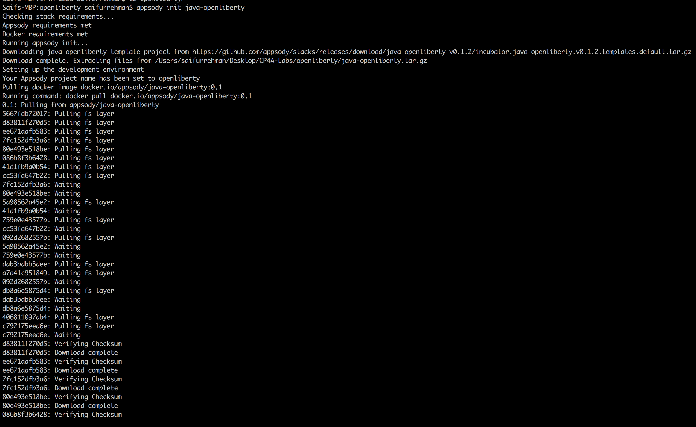
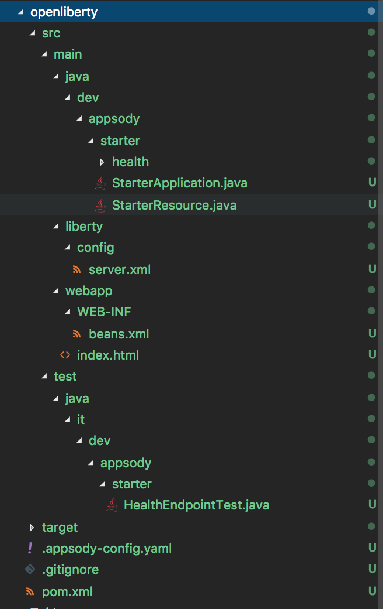
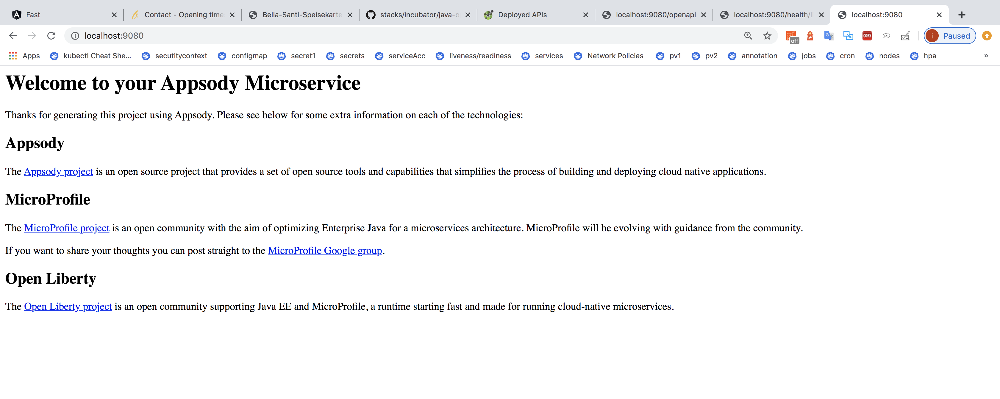

## What is Appsody?

Appsody is an open source project that includes a set of tools and capabilities you can use to build cloud-native applications.

Using a powerful, intuitive CLI, you can develop applications in a continuous, containerized run, test, and debug environment and then build and deploy to Kubernetes.

A core component of Appsody is a set of pre-configured stacks and templates for a growing set of popular open source runtimes and frameworks, including Node.js, Eclipse Microprofile, Quarkus, Spring Boot, and more. These stacks act as a foundation on which to build applications for Kubernetes and Knative deployments.

## Using Appsody CLI (Running a sample nodejs application)

### All commands for appsody 

1. ```build```       Build a local container image of your Appsody project.
2. ```completion```  Generates bash tab completions
3. ```debug```       Debug your Appsody project.
4. ```deploy```      Build and deploy your Appsody project to Kubernetes.
5. ```extract```     Extract your Appsody project to a local directory.
6. ```help```        Help about any command
7. ```init```        Initialize an Appsody project.
8. ```list```        List the available Appsody stacks.
9. ```operator```    Install or uninstall the Appsody operator from your Kubernetes cluster.
10. ```ps```          List the Appsody containers running in the local Docker environment.
11. ```repo```        Manage your Appsody repositories
12. ```run```        Run your Appsody project in a containerized development environment.
13. ```stack```       Tools to help create and test Appsody stacks
14. ```stop```        Stop the local, running Appsody container.
15. ```test```        Test your project in the local Appsody environment.
16. ```version```     Show the version of the Appsody CLI

### Running a sample Nodejs application locally through Appsody CLI

Appsody CLI will allow developers to pull pre built nodejs template created by application Architect, developer uses this template as a boilerplate to build on top of it. Appsody templates created by application architect will allow the developers to focus only buisness logic rather than worrying about others aspect of the application like logging, metering, load testing, and etc. Another name for these templates are called collections

1. Create a new directory and navigate to it
```
$ mkdir openliberty
$ cd openliberty
```

2. List down collections
```
$ appsody list
```


These are avaiable collections available for developers to use

3. Create a sample openliberty app

```
$ appsody init java-openliberty
```


It will start to pull and populate application code needed to run the application. Once you have executed the command above you will sucessfully be able to see this folder structure 




4. Run the application locally

```
$ appsody run 
```


Runs the application locally as a container in your machine. Appsody also support hot reloading. Example, whenever you change your code, it will rebuild and run your application code again. Let us see the following in the later steps.

5. Navigate to ``` localhost:9080 ``` to preview your application 



6. Lets add a new endpoint. This Endpoint will be a GET request that will output helloworld
```
$ curl http://localhost:9080/starter/hello
```
Create a new file under ``` src/main/java/dev/appsody/starter ``` , name it as ``` StarterHello.java ```

Add the following line of code in the file created

```Java
package dev.appsody.starter;

import javax.ws.rs.GET;
import javax.ws.rs.Path;


@Path("/hello")
public class StarterHello {

    @GET
    public String getRequestHello() {
        return "Hello World";
    }
}
```

Here you will see thar you have generated a new endpint 


You will also notice that api documention will also be created for your new endpoint


8. Application monitoring and logging endpoints
- Application endpoint: http://localhost:9080/
- Health endpoint: http://localhost:9080/health/ready
- Liveness endpoint: http://localhost:3000/live
- Readiness endpoint: http://localhost:3000/ready
- Metrics endpoint: http://localhost:3000/metrics (Login as username:admin  password adminpwd)
- OpenAPI Endpoint : http://localhost:9080/openapi 
- Swagger UI endpoint: http://localhost:9080/openapi/ui

9. To stop to local developmnet server

```
$ appsody stop
```